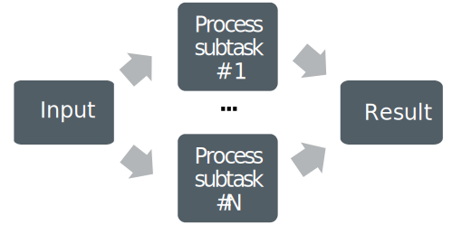
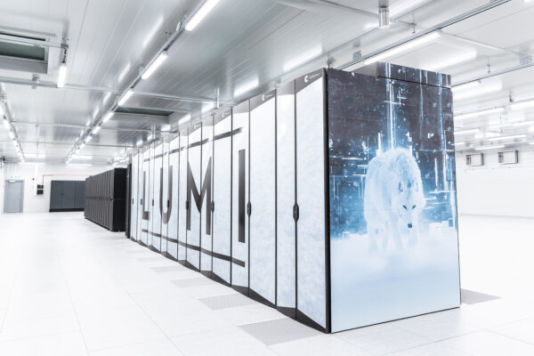
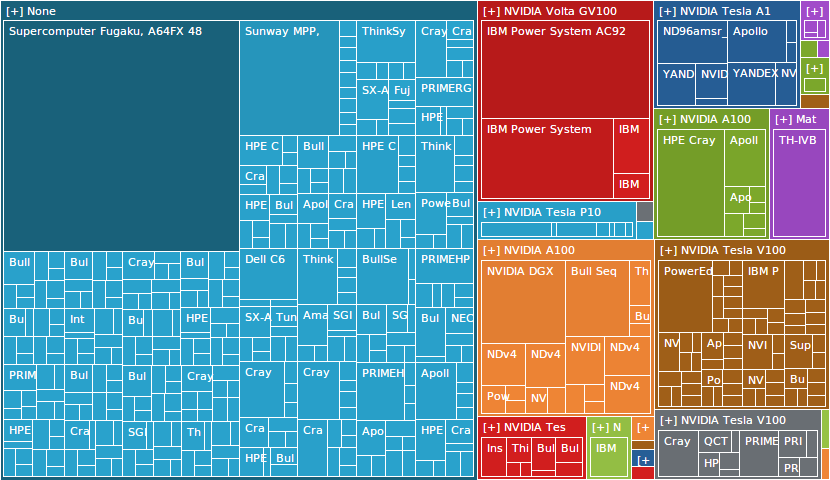
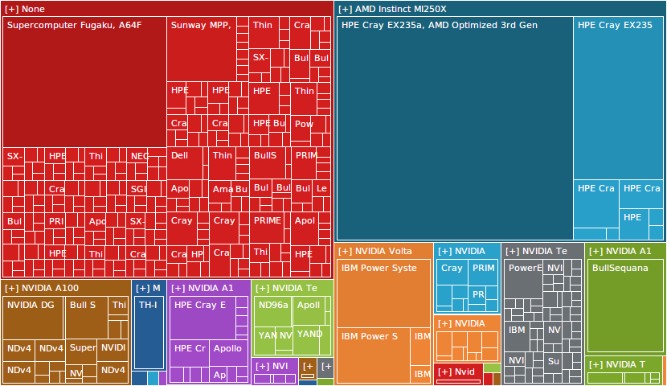

# Parallel computing concepts {.section}

# Computing in Parallel

<div class=column>
- Parallel computing
  - A problem is split into smaller subtasks
  - Multiple subtasks are processed simultaneously using multiple computing units
- Parallel overheads
  - Additional operations which are not present in serial calculation
  - Synchronization, redundant computations, communications

</div>
<div class=column>
<!-- Copyright CSC -->
 {.center width=100%}
</div>

# Types of Parallel Problems

- Tightly coupled
    - Lots of interaction between subtasks
    - Example: Weather simulation
    - Low latency, high speed interconnect is essential
- Embarrassingly parallel
    - Very little (or no) interaction between subtasks
    - Example: Sequence alignment queries for multiple independent sequences in bioinformatics


# Exposing Parallelism: Data Parallelism

<div class=column>
- Data parallelism
  - Data is distributed across cores
  - Each core performs simultaneously (nearly) identical operations with different data
  - Cores may need to interact with each other, e.g. exchange information about data on domain boundaries
</div>
<div class=column>

<!-- Copyright CSC -->
 {.center width=80%}

</div>


# Exposing Parallelism: Tasking

- Task farm (main / worker)

<!-- Copyright CSC -->
 {.center width=60%}

<br>

- Main worker sends tasks to workers and receives results
- There are normally more tasks than workers, and tasks are assigned dynamically


# Parallel Algorithms {.section}

# Parallelizable Problems

There needs to be independent computations<br><br>

<div class=column>
Gauss-Seidel iteration:
```
while True:
  for i:
    u[i] = (u[i-1] + u[i+1]
            - h**2 * f[i]) / 2

until converged(u)
```

Loop cannot be parallelized over `i` due to data dependency

</div>
<div class=column>
Jacobi iteration:
```
while True:
  for i:
    u_new[i] = (u_old[i-1] + u_old[i+1]
                - h**2 * f[i]) / 2
  swap(u_new, u_old)
until converged(u)
```

Loop can be parallelized over `i`

</div>

# Data Conflicts in Parallel Execution

- Race condition
    - Two (or more) processes access shared data concurrently
    - The final outcome depends on the sequence or timing of execution
    - Unpredictable and often leads to bugs
    - Example: Two threads incrementing the same counter simultaneously might overwrite each other’s result

- Deadlock
    - Two (or more) processes wait indefinitely for each other to release resources (or e.g. to send data)
    - System halts or stalls due to resource unavailability


# Data Distribution: Local vs. Global Dependencies

<div class=column>
Local dependencies

- Stencils: 
  ```
  v[i,j] = u[i-1, j] + u[i+1, j] + u[i, j-1] ...
  ```
- Finite element methods
- Particle based methods with short range interactions
- Number of communications per process remains constant
</div>
<div class=column>
Global dependencies

- Fourier transform 
  $X_k = \sum_{n=0}^{N-1} x_n \exp(-i \frac{2\pi}{N}k \cdot n)$
- Linear algebra: $C = A \times B$

  <!-- Copyright CSC -->
  {.center width=50%}

- Number of communication events per process increases with number of execution units

# Data Distribution: Load Balance

<div class=column>
Simple domains with similar computational cost

<br>
<!-- Copyright CSC -->
{.center width=95%}
</div>

<div class=column>
Simple domains with different computational cost

<br>
<!-- Copyright CSC -->
{.center width=49%}
</div>


# Parallel Programming Models {.section}

<!-- # Parallel Programming Models I

- Parallel execution is based on threads or processes (or both) which run at the same time on different CPU cores
- Processes
    - Interaction is based on exchanging messages between processes
    - MPI (Message passing interface)
- Threads
    - Interaction is based on shared memory, i.e. each thread can access directly other threads data
    - OpenMP, pthreads -->

# Parallel Programming Models

<!-- Copyright CSC -->
 {.center width=80%}
<div class=column>
**MPI: Processes**

- Independent execution units
- MPI launches N processes at application startup
- Works over multiple nodes
- Data exchange via messages
</div>
<div class=column>

**OpenMP: Threads**

- Threads share memory space
- Threads are created and destroyed  (parallel regions)
- Limited to a single node
- Data visible by all threads

</div>

<!-- # GPU Programming Models I

- GPUs are co-processors to the CPU
- CPU controls the work flow:
  - *offloads* computations to GPU by launching *kernels*
  - allocates and deallocates the memory on GPUs
  - handles the data transfers between CPU and GPUs
- GPU kernels run multiple threads
    - Typically much more threads than "GPU cores"
- When using multiple GPUs, CPU runs typically multiple processes (MPI) or multiple threads (OpenMP) -->

# GPU Programming Models

{.center width=40%}
<br>

- CPU launches kernel on GPU
- Kernel execution is normally asynchronous
    - CPU remains active
- Multiple kernels may run concurrently on same GPU


# Supercomputers {.section}


# Anatomy of a Supercomputer

<!-- Copyright CSC -->
{.center width=100%}


# Current Supercomputers

<div class=column>
- Large computer clusters
- A lot of standard, high-end server hardware connected to each other
- High-speed interconnect between compute nodes
- Example: LUMI
  - 2064 CPU nodes<br>(~260,000 CPU cores in total)
  - 2978 GPU nodes<br>(~12,000 MI250X GPUs in total)
</div>
<div class=column>
<center>
{.center width=70%}
EuroHPC JU LUMI (HPE Cray EX) <br>at CSC (2021–)
</center>
</div>

# Lumi

 {.center width=50%}


# GPUs: The New Default for Performance <!-- GPUs are becoming the norm -->

<center>
{.center width=65%}

- Top500 supercomputers grouped by the accelator type (Nov 2021 list)
</center>

# GPUs: The New Default for Performance <!-- GPUs are becoming the norm -->

<center>
{.center width=65%}

- Top500 supercomputers grouped by the accelator type (Nov 2022 list)
</center>

# GPUs: The New Default for Performance <!-- GPUs are becoming the norm -->

<center>
{.center width=65%}

- Top500 supercomputers grouped by the accelator type (Nov 2024 list)
</center>


# Summary

- Parallel Computing: data is splitted in small independent parts
  - Tightly coupled vs. Embarrassingly parallel, Data  vs. Task Parallelism
- Parallelization causes an extra cost not present in a serial program
  - Competition over the same data can cause race conditions or deadlocks
  - Data distribution: local vs. global dependencies, load balance
- Parallel programming models:
  - Processes vs. Threads (include GPU programming model)
- Parallel Programs run on Supecomputers
  - Nodes, Fast Interconect, Parallel Storage Servers
  - LUMI: 2064 CPU nodes (~260k CPU cores), 2978 GPU nodes (~12k MI250X)
  - GPUs are becoming the norm 
