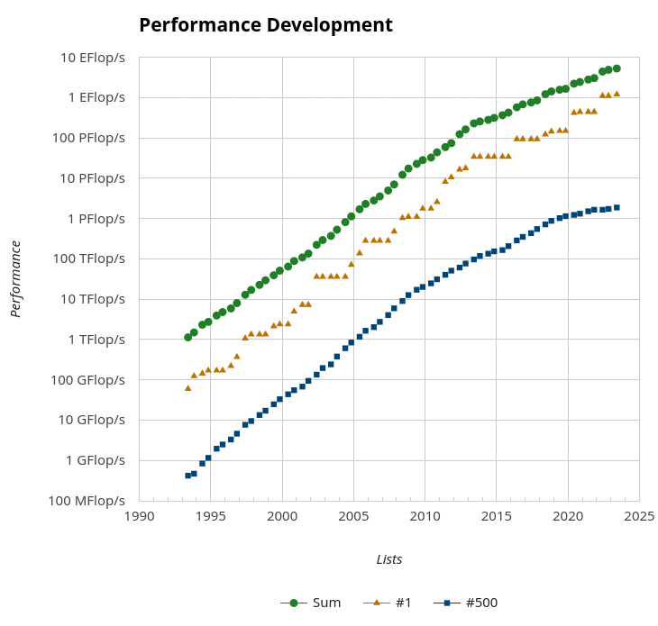

# Accelerators/GPUs {.section}

# High Performance Computing through the ages

{.center width=65%}

 
{.center width=100%}

# Accelerators/GPUs

- Specialized parallel hardware for compute-intensive operations
    - Co-processors for traditional CPUs
    - Based on highly parallel architectures
    - Graphics processing units (GPU) have been the most common
      accelerators during the last few years
- Promises
    - Very high performance per node
    - More FLOPS/Watt
- Usually major rewrites of programs required

# Challenges in using Accelerators/GPUs

**Applicability**: Is your algorithm suitable for GPU?

**Programmability**: Is the programming effort acceptable?

**Portability**: Rapidly evolving ecosystem and incompatibilities between vendors.

**Availability**: Can you access a (large scale) system with GPUs?

**Scalability**: Can you scale the GPU software efficiently to several nodes?

# CPU vs. GPU

#  Heterogeneous Programming Model

- GPUs are co-processors to the CPU
- CPU controls the work flow:
  - *offloads* computations to GPU by launching *kernels*
  - allocates and deallocates the memory on GPUs
  - handles the data transfers between CPU and GPUs
- CPU and GPU can work concurrently
   - kernel launches are normally asynchronous

# Using GPUs

1. Use existing GPU applications
2. Use accelerated libraries
3. Features in language standards
4. Directive based methods
    - OpenMP, OpenACC
5. High-level GPU programming
    - **C++ stdpar**, **Kokkos**, **SYCL**, ...
6. Use direct GPU programming
    - CUDA, HIP, ...

**Easier, more limited**

{width=16% }

**More difficult, more opportunities**

# GPUs @ CSC

- **Puhti-AI**: 80 nodes, total peak performance of 2.7 Petaflops
    - Four Nvidia V100 GPUs, two 20-core Intel Xeon processors, 3.2 TB fast local storage, network connectivity of 200Gbps aggregate bandwidth  
- **Mahti-AI**: 24 nodes, total peak performance of 2. Petaflops
    - Four Nvidia A100 GPUs, two 64-core AMD Epyc processors, 3.8 TB fast local storage,  network connectivity of 200Gbps aggregate bandwidth   
- **LUMI-G**: 2978 nodes, total peak performance of 500 Petaflops
    - Four AMD MI250X GPUs, one 64-core AMD Epyc processor, network connectivity of 800Gbps aggregate bandwidth

# Summary

- GPUs can provide significant speed-up for many applications
    - High amount of parallelism required for efficient utilization of GPUs
- GPUs are co-processors to CPUs
   - CPU offloads computations to GPUs and manages memory
- Programming models for GPUs
    - Directive based methods: OpenACC, OpenMP
    - Frameworks: Kokkos, SYCL
    - C++ language extensions: CUDA, HIP
