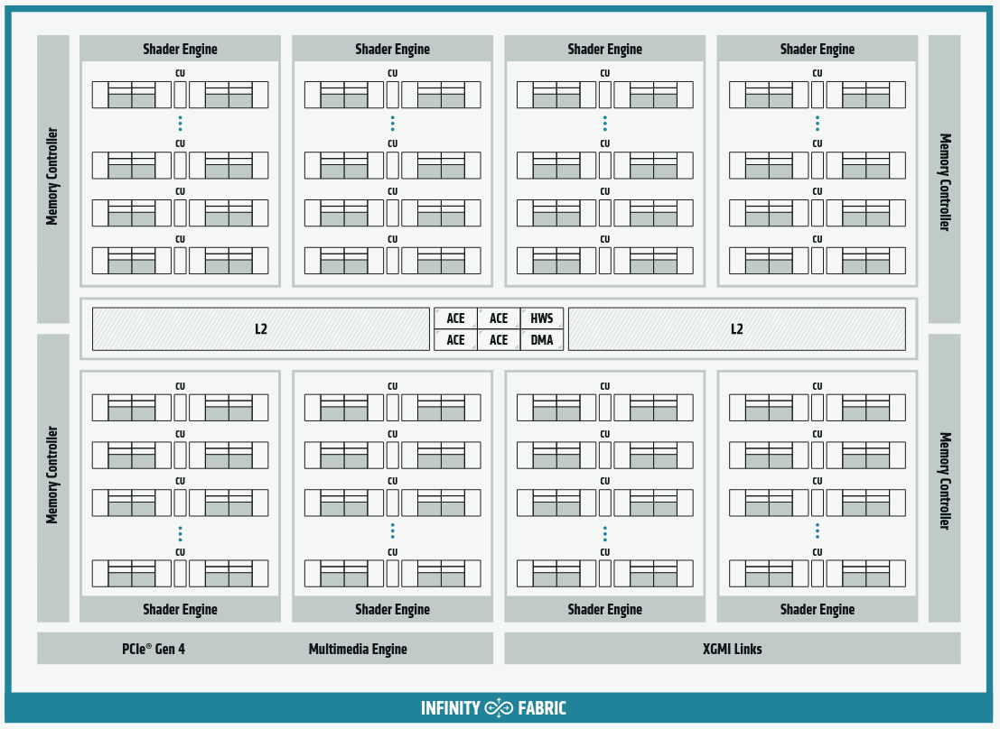

# GPU Execution Model{.section}

#  Heterogeneous Programming Model

- GPUs (devices) are co-processors to the CPU (host)
- CPU controls the work flow:
  - *offloads* computations to GPU by launching *kernels*
  - allocates and deallocates the memory on GPUs
  - handles the data transfers between CPU and GPUs
- CPU and GPU can work concurrently
   - kernel launches are normally asynchronous
   - memory copies between CPU and GPU can be done asynchronously

# Example: axpy

<div class="column">

Serial CPU code of `y=y+a*x`:

- Loop over each index

<small>
```cpp
void axpy_(int n, double a, double *x, double *y)
{
    for(int id=0;id<n; id++) {
        y[id] += a * x[id];
    }
}
```
</small>
</div>

<div class="column">

On an accelerator:

- Instances of the same function, **kernels**
- An instance of kernel is run for each index (implicit loop)
- SIMT (single instruction multiple threads)
<small>

```cpp
GPU_K void axpy_(int n, double a, double *x, double *y, int id)
{
        y[id] += a * x[id]; // id<n
}

```
</small>

</div>

# GPU threads

<div class="column">


{.center width=2%}

<div align="center"><small>A thread is running on execution unit</small></div>

</div>

<div class="column">

{.center width=12%} 

<div align="center"><small>The smallest execution unit in a GPU.</small></div>
</div>

- GPU threads are very light execution contexts.
- Threads execute a stream of instructions running on different execution units
- Each thread runs the same **kernel** (SIMT). 
- Each thread processes different elements of the data (SIMD).
- Much more threads than execution units

# Warp / wavefront

<div class="column">


{.center width=15%}

<div align="center"><small>Execution is done per warp / wavefront</small></div>

</div>

<div class="column">

{.center width=55%} 

<div align="center"><small>Scheme of a SIMD unit in an AMD GPU</small></div>
</div>
<ul>
  <li><small>GPU threads are grouped together in hardware level
    <ul>
      <li><small>warp (NVIDIA, 32 threads), wavefront (AMD, 64 threads)</small></li>
    </ul>
  </small></li>
  <li><small>All members of the group execute the same instruction</small></li>
  <li><small>In the case of branching, each branch is executed seque


# Thread blocks

<div class="column">

{.center width=13%}

<div align="center"><small>Thread blocks</small></div>

</div>

<div class="column">
{.center width=13%}

<div align="center"><small>Compute Unit in an AMD GPU</small></div>
</div>
- Threads are grouped in blocks
- Each block is executed in specific unit
    - Streaming multiprocessor, SMP (NVIDIA), compute unit, CU (AMD)
- Maximum number of threads in  a block limited by hardware
- Synchronization is possible within a block
- Communication via local shared memory within a block

# Grid of thread blocks

<div class="column">

{.center width=33%}

<div align="center"><small>A grid of thread blocks executing the same **kernel**</small></div>

</div>

<div class="column">
{.center width=48%}

<div align="center"><small>AMD Instinct MI100 architecture (source: AMD)</small></div>
</div>

- Thread blocks are organized into a grid
    - Total number of threads = number of blocks $\mathrm{\times}$ threads per block
- In order to hide latencies, there should be more blocks than SMPs / CUs
- No synchronization between blocks

# Terminology with different vendors


<table class="docutils align-center" id="id7">
<thead>
<tr class="row-odd"><th class="head"><p>NVIDIA</p></th>
<th class="head"><p>AMD</p></th>
<th class="head"><p>SYCL</p></th>
</tr>
</thead>
<tbody>
<tr class="row-even"><td style="text-align: center"; colspan="2"><p>grid of threads</p></td>
<td><p>NDRange</p></td>
</tr>
<tr class="row-odd"><td style="text-align: center"; colspan="2"><p>block</p></td>
<td><p>work-group</p></td>
</tr>
<tr class="row-even"><td><p>warp</p></td>
<td><p>wavefront</p></td>
<td><p>sub-group</p></td>
</tr>
<tr class="row-odd"><td style="text-align: center"; colspan="2"><p>thread</p></td>
<td><p>work-item</p></td>
</tr>
</tbody>
</table>

# Summary

- GPU hardware has high degree of parallelism
- Many threads execute the same instruction (SIMT), working on different data (SIMD)
- Threads are organized in a grid of blocks 
- All threads within a group (*warp / wavefront*) execute the same instructions
    - branching within a *warp / wavefront* should be avoided
- Memory accesses are done per *warp / wavefront*
- High-level frameworks aim to hide these low level details


