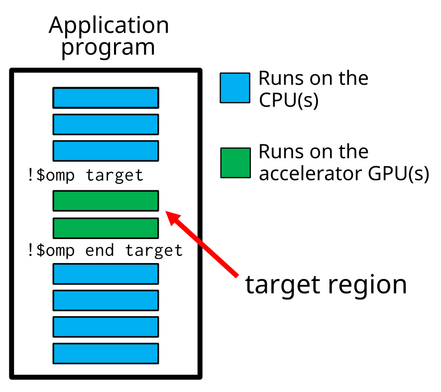
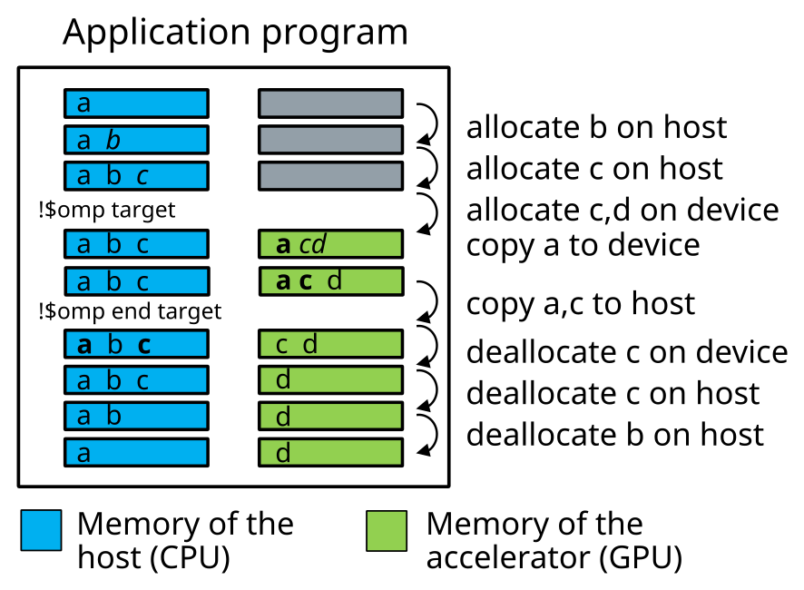
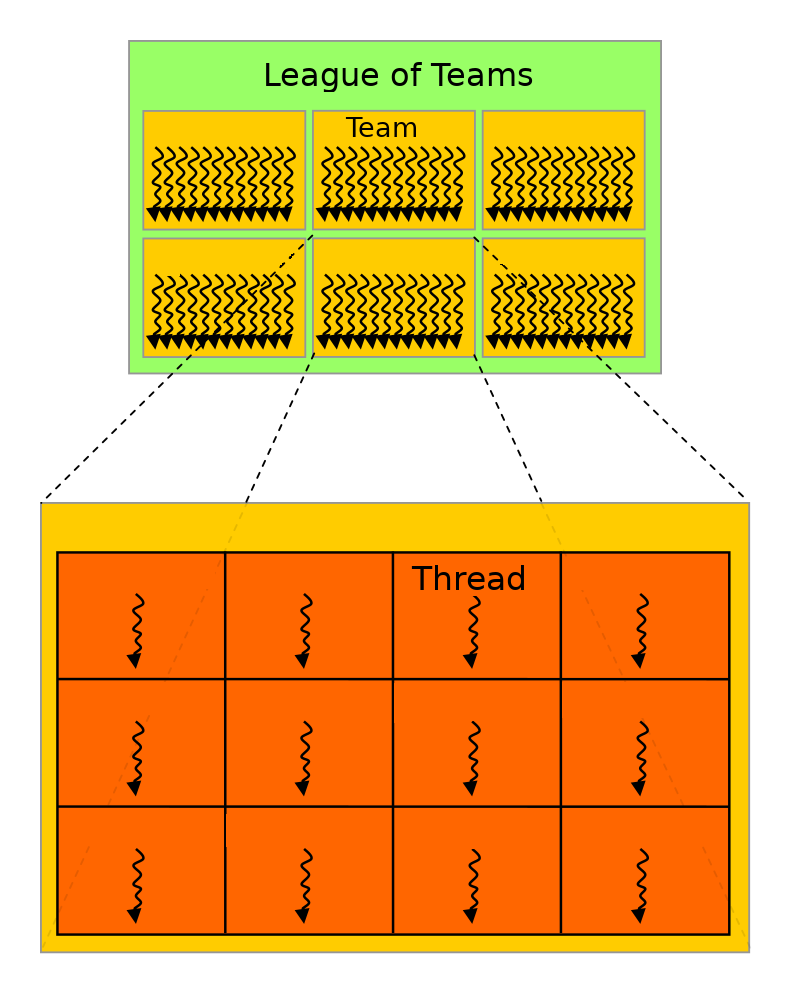
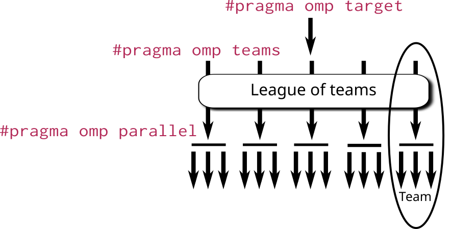

# Outline

- The idea of OpenMP offload
- OpenMP offload in practice: Creating, compiling, and running a GPU-accelerated program


# The idea of OpenMP offload {.section}

# What is OpenMP offload?

- High-level abstraction layer for GPU programming
- Annotate the code with compiler directives that instruct the compiler
  to parallelize and offload specific code regions to the GPU
  - If compiled without OpenMP, directives are ignored
- The same code can be compiled and run on various systems
  - NVIDIA GPUs, AMD GPUs, Intel GPUs, FPGAs, ...
  - CPUs only (threading, vectorization)
- OpenMP is a standard with both C/C++ and Fortran bindings
  - <https://www.openmp.org/specifications/>
  - See especially the OpenMP Examples documents!

# Directive languages and performance

- "Write once, run everywhere"
  - It is true that you can get portability
  - It is *not necessarily* true that you get *performance* portability

- It is possible to optimize a code for performance on the GPU
  - Many optimisations will likely increase the performance also on the CPU
  - A highly optimised code will possibly be slower on the CPU

# OpenMP vs. OpenACC

- OpenACC is very similar compiler directive based approach for GPU programming
  - Open standard, NVIDIA major driver
- Why OpenMP and not OpenACC?
  - OpenMP is likely to have a more extensive platform and compiler support
  - Currently, OpenACC support in AMD GPUs is limited (supported only for Fortran on LUMI)
  - Currently, OpenACC can provide better performance on NVIDIA GPUs

# OpenMP vs. CUDA/HIP

- Why OpenMP and not CUDA/HIP?
  - Less code to start utilizing GPU acceleration
  - Simple things are possibly simpler
  - Same code can be compiled for CPU and GPU targets
- Why CUDA/HIP and not OpenMP?
  - Can access all the features of the GPU hardware
  - Better control and assurance that the code will work as intended
  - More optimization possibilities
- Note! It's possible to use **both** OpenMP and CUDA/HIP in an application
  - Example: the bulk of the code accelerated with OpenMP,
    performance critical parts optimized with CUDA/HIP


# OpenMP execution model {.section}

# OpenMP execution model

- Host-directed execution with an attached accelerator
  - Large part of the program is usually executed by the host
  - Computationally intensive parts are *offloaded* to the accelerator
- Accelerator can have a separate memory
  - OpenMP exposes the separate memories through *data environment* that defines the memory management and data transfer operations

# OpenMP execution model

<div class="column">
- Program runs on the host CPU
- Host offloads compute-intensive regions (*kernels*) and related data to the GPU
- Compute kernels are executed by the GPU
</div>

<div class="column">

</div>


# OpenMP data model in offload

<div class="column">
- If host memory is separate from device memory
  - Host manages memory of the device
  - Host copies data to/from the device
- When memories are not separate, no copies are needed (difference is transparent to the user)
</div>

<div class="column">

</div>


# OpenMP offload in practice {.section}

# Target construct

- OpenMP `target` construct specifies a region to be executed on GPU
  - Initially, runs with a single thread
- By default, execution in the host continues only after target region is finished
  - We'll have a look on asynchronous execution later today
- May trigger implicit data movements between the host and the device

<div class=column>
```c++
#pragma omp target
{
  // code executed in device
}
```
</div>

<div class=column>
```fortranfree
!$omp target
  ! code executed in device
!$omp end target
```
</div>

# Constructs that Generate Parallelism vs Distribute Work

- Target construct does not create any parallelism, so additional constructs are needed
- OpenMP `teams` and `parallel` constructs *create parallelism*
  - For example, `parallel` creates multiple threads (that do the same computation by default)
- OpenMP `distribute` and `for`/`do` constructs *distribute work* so that the created teams and threads do different work
  - For example, `for`/`do` assign different threads to different loop iterations (so that the computation work is distributed)

# Teams construct

<div class=column>
- A `teams` construct creates a league of teams
  - Number of teams is implementation dependent
  - Initially, a single thread in each team executes the following structured block
</div>

<div class=column>
{width=65%}
</div>

# Teams construct

<div class=column>
- No synchronization between teams is possible
- Probable mapping to hardware
  - Team &rarr; thread block, runs on a streaming multiprocessor (SM) / on a compute unit (CU)
</div>

<div class=column>
{width=65%}
</div>

# Creating threads within a team

- Just having a league of teams is typically not enough to leverage all the parallelism available in the accelerator
- A `parallel` construct within a `teams` region creates threads within each team
  - Number of threads per team is implementation dependent
  - With N teams and M threads per team there will be N x M threads in total

# Creating threads within a team

<div class=column>
- Threads within a team can synchronize
- Probable mapping to hardware
  - Thread &rarr; thread, runs on a core of SM / on a lane of a SIMD unit of CU
</div>

<div class=column>
{width=65%}
</div>

# Creating teams and threads

<div class=column>
```c++
#pragma omp target
#pragma omp teams
#pragma omp parallel
{
  // code executed in device
}
```
</div>

<div class=column>
```fortranfree
!$omp target
!$omp teams
!$omp parallel
  ! code executed in device
!$omp end parallel
!$omp end teams
!$omp end target
```
</div>

- Useful API functions: `omp_get_team_num()`, `omp_get_thread_num()`, `omp_get_num_teams()`, `omp_get_num_threads()`

- Demo: `hello.c`


# League of multi-threaded teams

{.center width=80%}


# Worksharing in the accelerator

- The `teams` and `parallel` constructs create teams and threads, however, all the threads are still executing the same code
- The `distribute` construct distributes loop iterations over teams
- The `for` / `do` construct distributes loop iterations over threads


# Worksharing in the accelerator

<div class=column>
```c++
#pragma omp target
#pragma omp teams
#pragma omp distribute
for (int i = 0; i < N; i++)
  #pragma omp parallel
  #pragma omp for
  for (int j = 0; j < M; j++) {
    ...
  }
```
</div>

<div class=column>
```fortranfree
!$omp target
!$omp teams
!$omp distribute
do i = 1, N
  !$omp parallel
  !$omp do
  do j = 1, M
    ...
  end do
  !$omp end do
  !$omp end parallel
end do
!$omp end distribute
!$omp end teams
!$omp end target
```
</div>

- Demo: `hello.c`

# Controlling number of teams and threads

- By default, the number of teams and the number of threads is up to the implementation to decide
- The `num_teams` clause for `teams` construct and `num_threads` clause for `parallel` construct can be used to specify number of teams and threads
  - May improve performance in some cases
  - Performance is most likely not portable

<div class=column>
```c++
#pragma omp target
#pragma omp teams num_teams(32)
#pragma omp parallel num_threads(128)
{
  // code executed in device
}
```
</div>

<div class=column>
```fortranfree
!$omp target
!$omp teams num_teams(32)
!$omp parallel num_threads(128)
  ! code executed in device
!$omp end parallel
!$omp end teams
!$omp end target
```
</div>


# Composite directives

- In many cases composite directives are more convenient
  - Possible to parallelize also single loop over both teams and threads

<div class=column>
```c++
#pragma omp target
#pragma omp teams distribute parallel for
for (int i = 0; i < N; i++) {
  p[i] = v1[i] * v2[i]
}
```
</div>

<div class=column>
```fortranfree
!$omp target
!$omp teams distribute parallel do
do i = 1, N
  p(i) = v1(i) * v2(i)
end do
!$omp end teams distribute parallel do
!$omp end target
```
</div>

# Collapsing loops

- The `collapse` clause can be used to combine nested loops to a single large loop

<div class=column>
```c++
#pragma omp target
#pragma omp teams distribute parallel for \
            collapse(2)
for (int i = 0; i < N; i++)
  for (int j = 0; j < M; j++) {
    ...
  }
```
</div>

<div class=column>
```fortranfree
!$omp target
!$omp teams distribute parallel do &
!$omp collapse(2)
do i = 1, N
  do j = 1, M
    ...
  end do
end do
!$omp teams distribute parallel do
!$omp end target
```
</div>


# Loop construct

- In OpenMP 5.0 a new `loop` worksharing construct was introduced
- Leaves more freedom to the implementation to do the work division
  - Tells the compiler/runtime only that the loop iterations are
    independent and can be executed in parallel
- Check that the compiler gives expected performance!

<div class=column>
```c++
#pragma omp target teams
#pragma omp loop
for (int i = 0; i < N; i++) {
  p[i] = v1[i] * v2[i]
}
```
</div>

<div class=column>
```fortranfree
!$omp target teams
!$omp loop
do i = 1, N
  p(i) = v1(i) * v2(i)
end do
!$omp end loop
!$omp end target teams
```
</div>


# Compiling and running {.section}

# Compiling an OpenMP offload program

- In addition to normal OpenMP options (*i.e.* `-fopenmp`), one needs to typically specify offload target (NVIDIA GPU, AMD GPU, ...)
- Compiler can also provide diagnostics
  - If and how loops were parallelized, what kind of data copies were added, ...
- See exercises

# Running an OpenMP offload program

- The compiled code can be executed as usual on supercomputer
- OpenMP implementations provide useful environment variables that can provide useful debug information in runtime
  - `CRAY_ACC_DEBUG`, `LIBOMPTARGET_INFO`, `NVCOMPILER_ACC_NOTIFY`, ...
- See exercises


# Summary

- OpenMP enables directive-based programming of GPUs and other accelerators with C/C++ and Fortran
- Host--device model
  - Host offloads computations to the device
- Host and device may have separate memories
  - Host controls copying into/from the device
- Key concepts:
  - League of teams
  - Threads within a team
  - Worksharing between teams and threads within a team
