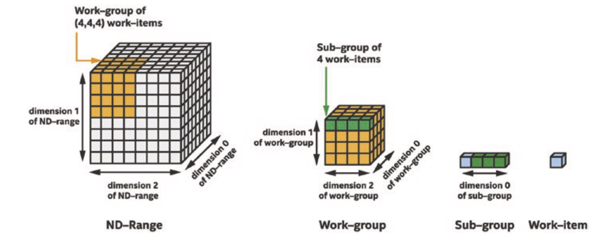

# Advanced SYCL{.section}

# Buffers and Accessors API 
- **Advantages**
    - automatic host–device data management
    - clear access semantics
    - explicit access modes (**read**, **write**, **read_write**) for safer kernel
    - safe synchronization, implicit dependencies
    - portability, structured programs
- **Disadvantages**
    - low performance on host–device data transfers
    - management overhead at buffer creation and destruction
    - requires explicit accessor creation with a specified mode, even for trivial cases
    - unintended synchronizations and accessors deadlocks
    - no control over memory, difficult interoperability, challenging debugging
  
# Unified Shared Memory (USM) I

- pointer-based approach to C/CUDA/HIP
- explicit allocation and  freeing of memory
- explicit dependencies
- explicit host-device transfers (unless using managed)
- explicit host-device synchronization 

# Unified Shared Memory II

| Function        | Location	         | Device Accessible
------------------+--------------------+--------------------
| malloc_device	  | Device 	           | Yes                 
| malloc_shared	  | Dynamic migration  | Yes                 
| malloc_host	    | Host  	           | Device can read     

# AXPY with `malloc_device`  

<small>
```cpp
  std::vector<int> h_y(N, 2), h_x(N, 1);
  int a=3

  // Allocate device memory
  int* d_x = malloc_device<int>(N, q); 
  int* d_y = malloc_device<int>(N, q); 
  // Copy data from host to device
  q.memcpy(d_x, h_x.data(), N * sizeof(int)).wait(); 
  q.memcpy(d_y, h_y.data(), N * sizeof(int)).wait(); 

  q.submit([&](handler& cgh) {
    cgh.parallel_for(range<1>(N), [=](sid<1> id) {
      d_y[id] += a*x_d[i];
    });
  }).wait();
  // Copy results back to host
  q.memcpy(h_y.data(), d_y, N * sizeof(int)).wait();
  
  // Verify the results
  for (int i = 0; i < N; i++) {
    assert(h_y[i] == 5);
  }

  // Free the device memory
  sycl::free(d_y, q);
```
</small>


# AXPY with `malloc_shared`

<small>
```cpp
    int a=3;
    int* x = malloc_shared<int>(N, q);
    int* y = malloc_shared<int>(N, q);
    // Initialize from host
    for (int i = 0; i < N; i++) {
        x[i]=1; y[i] = 2; 
    }

    q.submit([&](handler& cgh) {
        cgh.parallel_for(range<1>(N), [=](id<1> idx) {
            y[idx] += a*x[i];
        });
    }).wait();

    // No memcpy needed — host can read directly
    for (int i = 0; i < N; i++) {
        assert(y[i] == 5);
    }
    // Free the shared memory
    sycl::free(y, q);
```
</small>


# Parallel launch with **nd-range** I

{.center width=100%}

<small>https://link.springer.com/book/10.1007/978-1-4842-9691-2</small>

# Parallel launch with **nd-range** II

 - enables low level performance tuning 
 - **nd_range** sets the global range and the local range 
 - iteration space is divided into work-groups
 - work-items within a work-group are scheduled on a single compute unit
 - **nd_item** enables to querying for work-group range and index.

```cpp
cgh.parallel_for(nd_range<1>(range<1>(N),range<1>(64)), [=](nd_item<1> item){
  auto idx = item.get_global_id();
  auto local_id = item.get_local_id();
  y[idx] += a * x[idx];
});
```

# Parallel launch with **nd-range** III
 - extra functionalities
    - each work-group has work-group *local shared memory*
        - faster to access than global memory
        - can be used as programmable cache
    - group-level *barriers* and *fences* to synchronize work-items within a group
        - *barriers* force all work-items to reach a speciffic point before continuing
        - *fences* ensures writes are visible to all work-items before proceeding
    - group-level collectives, for communication, e.g. broadcasting, or computation, e.g. scans
        - useful for reductions at group-level

# Local Shared Memory Usage 

- multiple accesses of data withing the same block
    - stencils, convolutions, N-body interactions, matrix-matrix multiplications, reductions
- transform non-coalesced to coalesced accesses
    -  matrix transposes, matrix-matrix multiplications, ...

**Check the exercises for more details in the exercises!**

# Summary

 - memory menagement using USM
 - kernel launch via **nd-range**
       - local shared memory
       - block (work group) level operations
